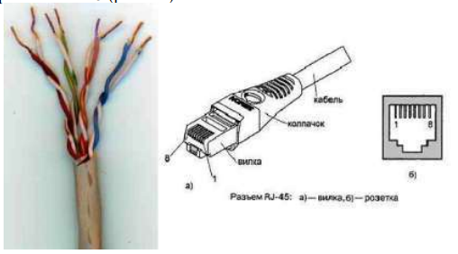
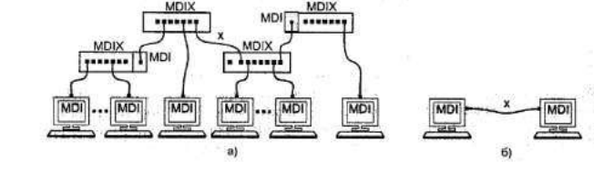
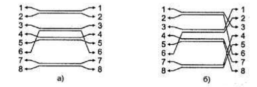
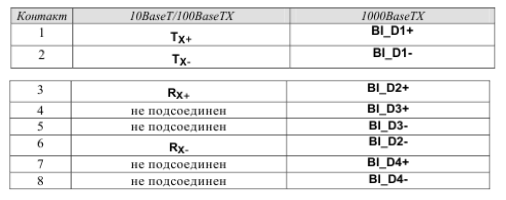
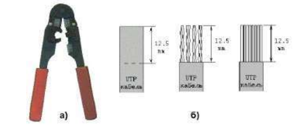
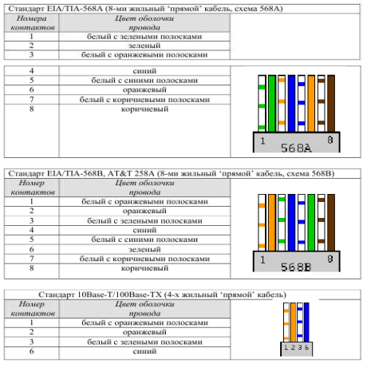
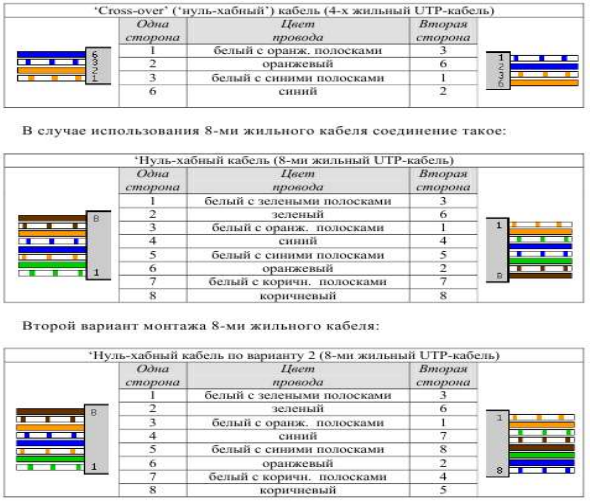
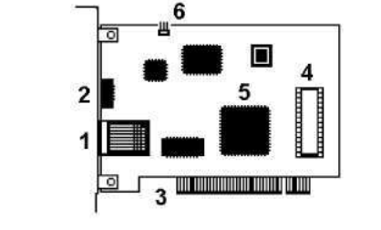
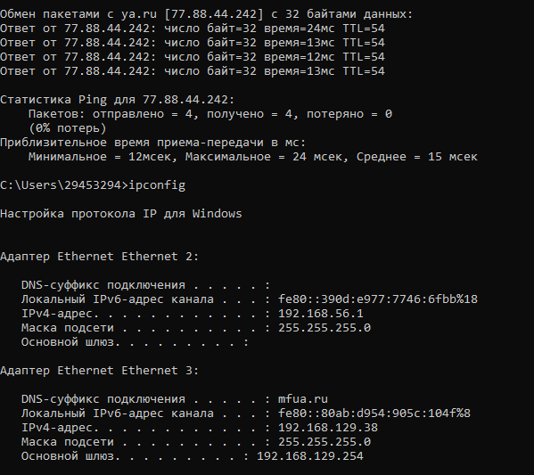

# Лабораторная работа №1 «Подключение персонального компьютера к локальной вычислительной сети»

Цель работы: приобретение практических знаний и навыков в выборе и
установке сетевых адаптеров, монтажу и разделке сетевого кабеля, физическому присоединению ЭВМ к кабельной системе при создании локальной компьютерной сети по технологии Ethernet.
Материалы, оборудование, программное обеспечение: IBM PCсовместимый персональный компьютер, сетевая карта (для шины данных PCI)
производительностью 10-100 Mbit/сек с разъемом RJ-45, кабель UTP категории
5, вилки RJ-45, обжимной инструмент.

Теоретическое введение

Сетевой стандарт Ethernet был разработан в 1975-х г. в исследовательском
центре корпорации Xerox, после чего доработан совместно DEC, Intel и
XEROX (отсюда сокращение DIX) и впервые опубликован как 'Blue Book
Standart' для Ethernet I в 1980 г. Этот стандарт получил дальнейшее развитие и
в 1985 г. вышел новый - Ethernet II (известный также как DIX).
На основе стандарта Ethernet DIX был разработан стандарт IEEE 802.3,
одобренный в 1985 году для стандартизации комитетом по LAN IEEE (Institute
of Electrical and Electronics Engineers). В зависимости от вида физической среды
передачи данных стандарт IEEE 802.3 имеет модификации (число 10 в начале
каждой обозначает скорость передачи данных 10 Мбит/сек):
• 10Base-5 (применяется коаксиальный кабель диаметром 0,5 дюйма - т.н.
толстый коаксиал с волновым сопротивлением 50 ом; максимальная длина
сегмента сети без повторителей 500 м, считается бесперспективным).
• 10Base-2 (коаксиальный кабель диаметром 0,25 дюйма - т.н. тонкий
коаксиал, волновое сопротивление 50 ом; максимальная длина сегмента сети
без повторителей 185 м, считается бесперспективным).
• 10Base-T (кабель на основе неэкранированной витой пары - UTP, Un
shielded Twisted Pair; физическая топология - звезда с концентратором в
центре, максимальное расстояние между концентратором и конечным
узлом - до 100 м).
• 10Base-F (волоконно-оптический кабель, топология сети аналогична
10BaseT; варианты: FOIRL допускает расстояние до 1000 м, 10Base-FL и
10Base-FB - до 2000 м).
В 1995 г. принят стандарт Fast Ethernet (IEEE 802.3u), в 1998 г. - Gigabit Ethernet (IEEE 802.3z), в 2002 г. - 10 Gigabit Ethernet (IEEE 802.3ae).
Ethernet и Fast Ethernet применяют один и тот же метод разделения среды
передачи данных CSMA/CD (Carrier Sense Multiple Access with Collision Detection, метод коллективного доступа с опознаванием несущей и обнаружением
коллизий).

Кабель UTP является наиболее дешевым (при обеспечении достаточной
скорости передачи данных и простоте монтажа). UTP-кабели категории 1
применяются в основном для телефонной разводки, UTP категории 3 служат
для передачи как голоса, так и данных при невысокой производительности
(диапазон частот до 16 MHz). Для высокоскоростных протоколов при передаче на большие расстояния могут применяться (более дорогие) кабели UTP
категорий 6 и 7 (экран вокруг каждой пары и вокруг всех жил соответственно,
рабочие частоты до 300 и 600 MHz).
В настоящее время при создании локальных компьютерных сетей практически всегда (для технологий Ethernet, Fast Ethernet и Gigabit Ethernet) применяют кабель UTP категории 5 (8 попарно скрученных медных жил, активное
сопротивление не более 9,4 ом на 100 м, полное волновое сопротивление 100
ом на частоте 100-120 MHz, затухание сигнала 0,8-22 дБ на частотах от 64 kHz
до 100 MHz). Каждый провод кабеля UTP маркирован цветом (синий и белый
с синими полосками, оранжевый и белый с оранжевыми полосками, зеленый
6
и белый с зелеными полосками, коричневый и белый с коричневыми
полосками по скрученным парам соответственно), для UTP-кабеля применяются разъемы RJ-45 (рис. 1.1).

Рисунок 1.1 — Кабель UTP категории 5 (слева) и разъем RJ-45, показаны
вилка (plug) и розетка (jack).
Отрезок UTP-кабеля (обычно не более 5 метров) со смонтированными
на его концах вилками RJ-45 называют Patch cord'ом. Вилки RJ-45 являются
неразборными, при необходимости кабель просто отрезают около вилки и
монтируют новую.
Для технологии Ethernet используется топология 'звезда' с концентратором в центре, причем определены порты типа MDI (Medium Depended Interface, разъем сетевого адаптера) и MDIX (MDI crossing, разъем портов сетевого
концентратора), см. рис. 1.2.
При соединении MDI-MDIX (подключение конечных узлов сети к
портам активного оборудования) используется 'прямой' кабель (рис. 1.3a),
при соединении MDI-MDI (непосредственное соединение адаптеров
компьютеров, рис. 1.2б) или MDIX-MDIX (соединение двух
коммуникационных устройств) используют 'перекрестный' (кроссовый)
кабель (рис. 1.3б, причем на рис. 1.2 'перекрестный' кабель обозначен
символом x).

Рисунок 1.2 — Сеть 10BaseT/1 00BaseTX: a) - звезда, б) -
непосредственное соединение двух компьютеров (двухточечное соединение)

Большинство современных коммутаторов используют функцию
автоопределения типа кабеля (MDI или MDIX), что почти исключает
вероятность ошибочного подсоединения.

Рисунок 1.3 — Интерфейсные кабели Ethernet: a) - 'прямой', б) -
'перекрестный' (кроссовый)
В 10- и 100-мегабитном Ethernet'е (10BaseT/100BaseTX) названия
контактов содержат символы TX (transmitter, передатчик), RX (receiver,
приемник) со знаками '+' и '—' и из 8 жил используется только половина (рис.
1.3); для Gigabit Ethernet (1000BaseTX) используются все 8 медных жил
(обмен данными по 4 парам жил в обоих направлениях одновременно),
подсоединение соответствует табл. 1.1.

Таблица 1.1. — Разъем RJ-45 адаптера Ethernet.

Сигналы по каждой двухпроводной линии
передаются дифференциальным способом (с
противоположной полярностью по линиям '+' и '-
'), причем входные и выходные цепи сетевых
адаптеров имеют гальваническую развязку (рис.
справа).
Кабель UTP соединяется с вилкой RJ-45 без применения пайки. При
монтаже вилки RJ-45 на кабель UTP-5 удаляют внешнюю оболочку кабеля
на длину 12,5 мм, см. рис. 1.4б; для удаления оболочки на специальном
инструменте (рис. 1.4a) имеется специальный нож и ограничитель длины
удаляемой оболочки. Снимать изоляцию с жил не нужно, однако жилы
следует расположить на плоскости в соответствие со схемой заделки (правое
8
изображение из рис. 1.4б и нижеследующие схемы).

Рисунок 1.4 — Обжимной инструмент для разделки UTP-кабеля (a) и
последовательность снятия внешней оболочки с сетевого кабеля (б).
Варианты заделки проводов (разводка проводов витой пары) показаны
ниже ('прямой' кабель). В качестве схем заделки для 8-ми жильного кабеля
равноценно можно использовать схему 568A или 568B (но одинаковую для
данной сети, рекомендуется первая), для 4-х жильного кабеля используется
схема согласно последнему из рисунков.

После описанного расположения жил на плоскости следует повернуть
вилку контактами к себе (как на рис. 1.5) и аккуратно надвинуть на кабель до
упора, чтобы провода прошли под контактами.
Последним действием является обжим вилки. На
обжимном инструменте имеется специальное гнездо,
в которое вставляется вилка с проводами, после чего
нажатием на ручки инструмента вилка обжимается
(рис. a) справа). При этом контакты (на рис. показаны
желтым цветом) будут утоплены внутрь корпуса, прорежут изоляцию проводов и обеспечат надежный
контакт жил кабеля с контактами вилки. Фиксатор
провода также должен быть утоплен в корпус
(нажатие по стрелке 1 на рис. справа).
В крайнем случае (если нет обжимного
инструмента) можно обжать разъем RJ-45 тонкой отверткой (рис. слева). При
этом следует утопить все 8 шт. контактов (1) в корпус, а затем утопить и
фиксатор провода (3). Полезно подложите что-либо под разъем, чтобы не
сломать его фиксатор (2). Это не есть самый надежный способ монтажа, но
приемлемый.
Для непосредственного соединения двух компьютеров можно
рекомендовать показанное ниже соединение ('перекрестный' кабель),
приведен вариант 4-х жильного т.н. 'нуль-модемного кабеля'.

При тщательном выполнении монтажа вилок RJ-45 достигается
устойчивый контакт между жилами кабеля и контактами вилки. В редких
случаях (выявляемых обычно уже на этапе настройки программного
обеспечения поддержки сети) требуется проверка физического соединения
портов (выполняется с помощью кабельных тестеров или просто омметром).
Розетка представляет собой гнездо (разъем) соединителя с каким-либо
приспособлением для крепления кабеля и корпусом для удобства монтажа,
обычно в комплекте поставляется и вилка. Внешняя розетка представляет
собой небольшую пластмассовую коробочку, к которой прилагается шуруп и
двухсторонняя наклейка для монтажа на стену. Такая розетка служит
окончанием сетевого кабеля, обычно разводимого по стене помещения и
помещенного в коробах. В т.н. розетках типа KRONE для монтажа кабеля
UTP-5 используется специальная пластина с щелью, в которую заталкивается
провод, при этом прорезается изоляция и жила кабеля входит в надежный
контакт с пластиной (пайка не применяется). Для монтажа проводов имеется
специальный инструмент, который помимо заталкивания проводов в щель
обрезает лишние его куски. В любом случае настоятельно рекомендуется
после тщательного замера длины кабеля оставить по 1-1,5 м с каждой стороны
для монтажа и укладки части кабеля в непосредственной близи от компьютера (или иного сетевого устройства).
Сетевая карта или сетевой адаптер (NIC, Network Interface Card) - плата расширения, обычно вставляемая в разъем системной (материнской) платы (main board) компьютера; современные системные платы обычно имеют
встроенную сетевую карту. На рис. 1.6 показана сетевая карта шины данных PCI:
 1 - разъем под витую пару (RJ-45),
 2 - светодиодный индикатор
активности сети, 
3 - шина данных PCI, 
4 - панелька под микросхему BootROM
(для загрузки операционной системы компьютера не с локального диска, а с
сервера сети), 5 - микросхема контроллера платы, 6 - коннектор подключения
3-х проводного кабеля к системной плате для 'пробуждения' по сети (Remote
Wake Up; для этого передается специальный кадр Magic Packet, при приеме
которого ПК «просыпается»).

Рис. 1.6 сетевая карта шины данных PCI
Для определения точки назначения пакетов в сети Ethernet используется
т.н. MAC (Media Control Access)-адрес. Это уникальный серийный номер,
присваиваемый каждому сетевому устройству Ethernet для идентификации
его в сети. MAC-адрес присваивается адаптеру его производителем, но может
быть изменен программно. В обычном режиме работы сетевые адаптеры
просматривают весь проходящий сетевой трафик и ищут в каждом кадре
свой MAC-адрес. Если такой находится, то устройство (адаптер) обрабатывает
этот кадр. MAC-адрес имеет длину 6 байт (48 бит) и обычно записывается в
шестнадцатеричном виде, например, 12:34:56:78:90:AB (двоеточия между
байтами делают число более читабельным).
Каждый производитель присваивает адреса из принадлежащего ему диапазона адресов. Первые три байта адреса определяют производителя, напр.:

• 00000C Cisco

• 00000E Fujitsu

• 00001D Cabletron

• 00004C NEC Corporation

• 000061 Gateway Communications

• 000062 Honeywell

• 0080C8 D-Link

• 00A024 3Com

• 00C049 US Robotics

Обычно все поддерживающие высшие скорости обмена данными сетевые
адаптеры работают и на меньших скоростях (если комплементарное устройство не поддерживает данной скорости, но совместимо по стандарту
Ethernet). Позволяет это протокол согласования режимов (auto negotiation,
процесс основан на обмене специальными служебными импульсами), выполняемый каждый раз при установлении соединения после физического
подключения (при инициализации портов) и позволяющий выбрать
наиболее эффективный из режимов, доступных обоим портам.

Для обеспечения корректной работы каждой сетевой платы необходимо
определить для нее адрес ввода-вывода (In/Out port) и номер прерывания
(IRQ). Конфигурирование сетевой платы заключается в настройке ее на свободные адрес и прерывание, которые затем будут использоваться операционной системой. Адрес (In/Out port) и прерывание (IRQ) для каждой сетевой
платы должно быть отличным от других устройств компьютера. Современные
сетевые карты поддерживают технологию Plug-end-Play и автоматически
выполняют эту операцию. Программная поддержка сетевых карт
обеспечивается драйверами, для операционной системы Windows
возникновение проблем с драйверами маловероятно.

# Контрольные вопросы для самопроверки:

• Какие сетевые кабели использует технология Ethernet? Что такое кабель UTP? В чем его достоинства и недостатки?

Кабели, используемые Ethernet:
Технология Ethernet за свою историю использовала различные типы кабелей:

Коаксиальный кабель: (Толстый Ethernet и Тонкий Ethernet) — использовался в ранних версиях (10BASE5, 10BASE2). Сейчас устарел.

Витая пара (Twisted Pair): Самый распространенный тип кабеля в современных локальных сетях (стандарты 10BASE-T, 100BASE-TX, 1000BASE-T).

Оптоволокно (Fiber Optic): Используется для магистралей и соединений на больших расстояниях, обеспечивает высокую скорость и защиту от помех.

Кабель UTP:
UTP (Unshielded Twisted Pair) — это неэкранированная витая пара. Он состоит из нескольких пар медных проводов, скрученных между собой для взаимного подавления электромагнитных наводок, и общей пластиковой оболочки. Отсутствие дополнительного экрана (фольги или оплетки) делает его гибким и тонким.

Достоинства:

Низкая стоимость: Самый дешевый тип медного кабеля.

Простота монтажа: Легко разделывается и обжимается коннекторами RJ-45.

Гибкость: Удобен для прокладки в труднодоступных местах и углах.

Недостатки:

Чувствительность к помехам: Отсутствие экрана делает его уязвимым к сильным электромагнитным полям (например, рядом с силовыми кабелями).

Ограничение по длине: Максимальная длина сегмента без усилителя (повторителя) составляет всего 100 метров.

Простота прослушивания: В отличие от оптоволокна, излучает электромагнитную энергию, что позволяет при желании перехватывать сигнал.

• Что такое сетевые устройства MDI и MDIX? Для соединения каких устройств необходим 'перекрестный' (кроссированный) кабель?

MDI (Medium Dependent Interface) — это стандартный порт, который использует обычную распиновку (контакты 1 и 2 — передача (Tx), контакты 3 и 6 — прием (Rx)). Так устроены сетевые карты компьютеров.

MDIX (Medium Dependent Interface Crossover) — это порт с "перекрещенной" внутри схемой (кроссовер). В нем прием и передача "перевернуты" внутри самого порта: контакты 1 и 2 слушают (Rx), а 3 и 6 — говорят (Tx). Так обычно устроены порты коммутаторов (свитчей) и концентраторов (хабов).

Для чего нужен перекрестный кабель?
Если соединить два устройства с одинаковыми портами (например, компьютер-компьютер), то их передатчики (Tx) окажутся подключены к передатчикам друг друга, и связь не установится.

Прямой кабель (Straight-through): Нужен для соединения разнотипных устройств (компьютер — свитч, роутер — свитч).

Перекрестный кабель (Crossover): Исторически требовался для соединения однотипных устройств (компьютер-компьютер, свитч-свитч, компьютер-роутер (напрямую)).

• Почему при монтаже вилки RJ-45 на кабель нет необходимости снимать
изоляцию с отдельных жил кабеля?
Это связано с конструкцией самого коннектора (вилки) RJ-45 (8P8C).
Внутри корпуса вилки находятся металлические ножи-контакты. Когда вы используете кримпер (обжимные клещи), эти ножи прорезают тонкую пластиковую изоляцию отдельной жилы и врезаются непосредственно в медную сердцевину провода. Этот метод называется "врезка контактов" (Insulation-Displacement Connection, IDC).
Таким образом, операция снятия изоляции заменяется одновременным процессом прорезания и зажатия, что обеспечивает надежный электрический контакт и герметичность (изоляция жилы остается на месте, защищая медь от окисления).

• Что такое 'нуль-модемный' кабель и для каких целей он применяется?

Нуль-модемный кабель — это кабель для последовательного интерфейса (COM-порта, RS-232), который напрямую соединяет два компьютера, имитируя связь через модем.
В отличие от стандартного модемного кабеля, где провода идут "точка-в-точку" (контакт 2 к контакту 2 и т.д.), в нуль-модемном кабеле выполнено перекрещивание линий приема и передачи (TxD одного устройства соединяется с RxD другого, и наоборот).

Цели применения:

Прямое соединение компьютеров: Для передачи файлов с помощью ПО вроде Norton Commander, DOS Shell или LapLink (до эпохи массового распространения сетевых карт).

Настройка сетевого оборудования: Для подключения к консольному порту (Console Port) коммутаторов, роутеров и серверов для их начальной настройки, когда нет сетевого доступа.

Отладка встроенных систем: Для подключения к одноплатным компьютерам (Raspberry Pi и т.п.) для вывода отладочной информации.

• Каким образом однозначно идентифицируются сетевые адаптеры? С
какой
целью введена возможность изменения MAC-адреса?

Идентификация:
Каждый сетевой адаптер (сетевая карта, Wi-Fi модуль) имеет уникальный физический адрес, который называется MAC-адрес (Media Access Control address). Он присваивается устройству на заводе-изготовителе.
MAC-адрес имеет длину 48 бит и записывается в шестнадцатеричном виде. Первая половина адреса (24 бита) — это идентификатор производителя (OUI), вторая половина — уникальный номер устройства, назначаемый производителем. Это обеспечивает глобальную уникальность устройства в мире.

Зачем менять MAC-адрес?
Хотя физически адрес "зашит" в микросхему, современные драйверы и ОС позволяют изменить его программно. Это делается для:

Обхода фильтрации: В некоторых публичных сетях (Wi-Fi в отелях/аэропортах) доступ разрешен только определенным MAC-адресам. Сменив MAC на разрешенный, можно получить доступ.

Анонимности/Безопасности: Чтобы избежать отслеживания перемещений устройства по точкам доступа.

Решение конфликтов: В редких случаях, если в одной локальной сети оказались два устройства с одинаковым MAC-адресом (ошибка производителя), один из них можно изменить.

Активация ПО/доступа: Некоторые программы или интернет-провайдеры привязывают лицензию/подключение к MAC-адресу. При замене сетевой карты можно временно прописать старый MAC, чтобы все работало.

• В чем заключается процесс конфигурирование сетевой платы? Какие
параметры при этом настраиваются?

Конфигурирование сетевой платы — это процесс настройки программных параметров, необходимых для работы устройства в сети. Основные настраиваемые параметры (стека протоколов TCP/IP):

IP-адрес: Уникальный логический адрес компьютера в сети (например, 192.168.1.10). Может назначаться вручную или автоматически через DHCP.

Маска подсети (Subnet mask): Определяет, какая часть IP-адреса относится к адресу сети, а какая — к адресу узла (компьютера).

Основной шлюз (Default Gateway): IP-адрес устройства (обычно роутера), через который компьютер отправляет трафик в другие сети (например, в Интернет).

DNS-серверы: Адреса серверов, которые преобразуют понятные человеку имена сайтов (например, google.com) в цифровые IP-адреса.

Дополнительные параметры: Скорость и режим работы (автосогласование, 100 Мбит/с Full Duplex и т.д.), а также уже упомянутый MAC-адрес (иногда его смена считается частью конфигурации).

Проверка кабеля на работоспособность по средству ip запроса

