## Лабораторная работа №2 «Изучение программных средств тестирования и определения параметров настройки в компьютерных
сетях»

Цель работы: приобретение знаний и практических навыков в
использовании программного обеспечения для настройки и тестирования
компьютерной сети.

Материалы, оборудование, программное обеспечение: лаборатория,
оснащенная персональными компьютерами, объединенными в локальную сеть
с доступом в Интернет, утилиты сканирования беспроводных сетей.

Для тестирования параметров (маршрут и скорость передачи данных)
соединения с глобальной сетью Интернет, а также проверки правильности
сетевых настроек имеется большое количество программных средств.
Например, в операционной системе MS Windows – это встроенные
компьютерные программы – утилиты, которые позволяют оценить
надежность соединения и ряд других важных параметров.

## Задание к лабораторной работе
Студент получает типовые задания на выполнение
работы.
Методические указания и порядок выполнения работы
1. Ознакомиться с функциональными возможностями программного
обеспечения для настройки и тестирования компьютерной сети.
2. Выполнить рассмотренные сетевые утилиты.
3. Полученные результаты занести в отчет по лабораторной работе.

## Задание 1

Определить IP-адрес локального (своего) компьютера,
подключенного к сети.
Для определения IP-адреса своего компьютера в операционной
системе MS Windows необходимо воспользоваться утилитой IPCONFIG.
Для запуска данной программы необходимо выполнить команду ipconfig
в режиме командной строки. При выполнении данной команды на экране
монитора компьютера будет выведена основная конфигурация TCP/IP
для всех сетевых адаптеров (см. рисунок 1).

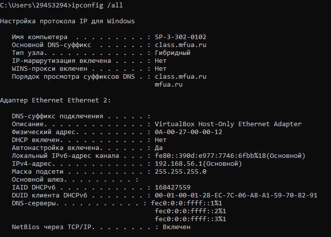

Рис. 1. Настройки протокола IP для операционной системы Windows

Для получения более полной информации выполните команду
ipconfig /all.

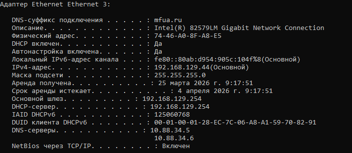

## Задание 2

Определить имя узла компьютера в локальной сети.
Для определения имени узла компьютера в локальной сети необходимо
использовать утилиту HOSTNAME. После выполнения команды hostname в
режиме командной строки на экран монитора выводится информация об
имени узла компьютера в локальной сети (см. рисунок 2.).

Рис. 2. Имя узла компьютера в локальной сети

## Задание 3

Определить скорость передачи информации в компьютерной сети и
наличие связи с узлом.
Проверить наличие пути до заданного узла и определить временные
характеристики этого пути можно, используя утилиту PING, которая
тестирует сетевое соединение путем посылки ICMP-пакетов типа «запрос
эха», на которые получатель отвечает ICMP-пакетом типа «эхо-ответ».
Утилите PING достаточно указать IP-адрес или DNS-имя, однако имеется ряд
ключей, позволяющих более тонко управлять ее работой (перечень выводится
на экран без указания в утилите IP-адреса или DNS-имени). Утилита PING
выводит результат каждого запроса/ответа на отдельной строке, а перед завершением работы выдает статистику: минимальное, максимальное и среднее
время передачи пакета, количество и долю потерянных пакетов. Фактически
PING является основной утилитой при тестировании сетевых соединений.
При использовании утилиты PING совместно с ключом «-t» можно для
тестирования скорости передачи информации отправлять в сеть
неограниченное число пакетов. Например, при выполнении в командной
строке команды ping –t ip_address (ключ –t отделяется пробелом от команды
ping, ip_address – IP-адрес (или DNS-имя) компьютера, который используется
для тестирования связи), будет происходить постоянная отправка пакетов и
можно обнаружить ситуацию, при которой появляется или пропадает связь.
Если ответ не пришел в течение определенного времени, то считается, что
между двумя устройствами отсутствует линия связи. Если в командной строке
ввести команду ping 127.0.0.1 (127.0.0.1 — IP-адрес специального сетевого
интерфейса в сетевом протоколе TCP/IP и обозначает, то же самое сетевое
устройство (компьютер), с которого осуществляется отправка сетевого пакета
или установление соединения). Использование адреса 127.0.0.1 позволяет
устанавливать соединение и передавать информацию для программ-серверов,
работающим на том же компьютере, что и программа-клиент, независимо от
конфигурации аппаратных сетевых средств компьютера.
Это дает возможность протестировать корректность работы самой
утилиты (см. рисунок 3). 

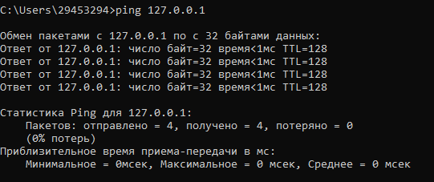

Рис. 4. Тест проверки связи с узлом KLGTU.RU

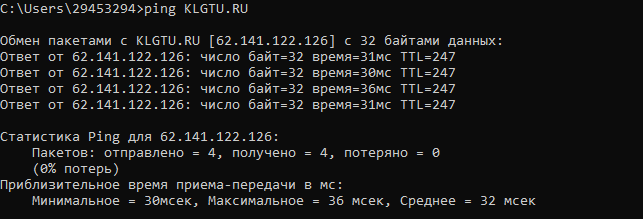

Рис. 5. Тест проверки связи с узлом YANDEX.RU

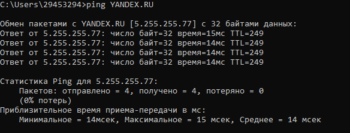

Рис. 6. Тест проверки связи с узлом MICROSOFT.COM

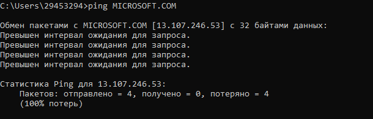

## Задание 4
Определить маршрут пакетов до заданного узла и получить временные
характеристики для каждого промежуточного маршрутизатора на этом пути.
Выявлять последовательность маршрутизаторов, через которые проходит
IP-пакет на пути к пункту своего назначения и время задержки на каждом из
них позволяет утилита TRACERT. Для выполнения утилиты необходимо
указать IP-адрес или DNS-имя конечного узла. Более тонко управлять ее
работой позволяют ключи (перечень выводится на экран без указания в
утилите IP-адреса или DNS-имени). Утилита, как и ранее описанная PING,
отправляет серию пакетов ICMP с разными значениями TTL (Time to live). В
вычислительной технике и компьютерных сетях — предельный период
времени или число итераций, или переходов, за который набор данных (пакет)
может существовать до своего исчезновения.
Для каждого пакета на экране отображается величина интервала времени
между отправкой пакета и получением ответа. Символ «*» означает, что ответ
на данный пакет не был получен. Если узел не отвечает, то при превышении
интервала ожидания ответа выдается сообщение «Превышен интервал
ожидания для запроса». Интервал ожидания ответа может быть изменен с
помощью ключа «–w» команды TRACERT. Для трассировки маршрута до
узла KLGTU.RU выполним команду tracert klgtu.ru (см. рисунок 7).

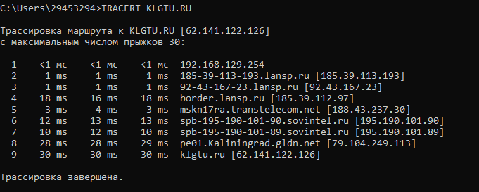

Рис. 7. Трассировка маршрута до узла KLGTU.RU

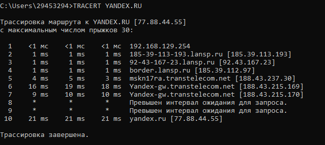

Рис. 8. Трассировка маршрута до узла YANDEX.RU

## Задание 5
Определить соответствие локального IP-адреса, физическому
(аппаратному) адресу в локальной сети.
Возможность просматривать и изменять ARP-таблицу, в которой
хранятся пары «МАС-адрес - IP-адрес» для тех узлов, с которыми в недавнем
происходил обмен данными, дает утилита ARP. Эта таблица формируется
автоматически при работе сетевого узла, но администратор сети может
вносить в нее записи вручную.
Узел, собирающийся отправить сообщение другому узлу, должен
предварительно узнать MAC адрес получателя сообщения. Для решения
данной задачи узел применяет технологию ARP, отправляя запрос узлам своей
локальной сети. Данный ARP запрос содержит IP адрес получателя. Из всех
узлов, получивших данный запрос, отвечает лишь тот, у кого
соответствующий IP адрес. В своем ответе (ARP отклике) этот узел сообщает
свой MAC адрес. И лишь после этого первый узел сможет отправить ему свое
сообщение. Компьютеры чаще всего отправляют свои сообщения
маршрутизатору и, следовательно, в своих ARP запросах они указывают
адрес основного шлюза. Для уменьшения ARP трафика компьютеры хранят в
своей памяти таблицу с IP и MAC адресами тех устройств, с которыми они в
последнее время обменивались сообщениями. Управление работой утилиты
возможно с помощью ключей (перечень выводится на экран командой arp).
Утилита ARP с ключом -a позволяет вывести на экран всю ARP-таблицу.
Выполним команду arp -a (см. рисунок 9).

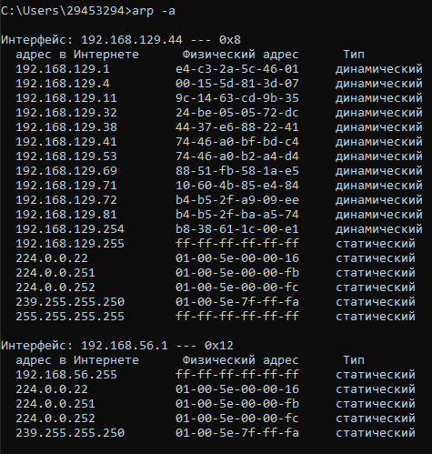

Рис. 9. ARP-таблица соответствия адресов

В данном случае мы видим, что у основного шлюза (192.168.0.254) MAC
адрес равен 90-f6-52-7f-3c-cc.

## Задание 6
Wireless Network Watcher - бесплатная утилита, которая сканирует
беспроводные сети и отображает список всех подключенных в данный момент
компьютеров и устройств. Для каждого обнаруженного устройства
отображается такая информация, как IP- и MAC-адрес, название компании
производителя и имя компьютера или устройства. Скопируем утилиту на свой
компьютер (прилагается к методическим указаниям) и выполним команду
WNetWatcher.exe (См. рисунок 10). Дополнительная информация (в
столбцах, которые не показаны на рисунке) содержит сведения о времени и
числе обнаружений устройства в сети, его активности в настоящий момент
времени. Используя ранее изученную сетевую утилиту PING определить
скорость передачи информации в компьютерной сети и наличие связи с
подключенными устройствами (узлами) беспроводной сети (См. рисунок 10).

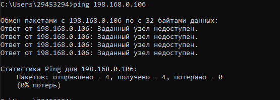

Рисунок 10. Тест проверки связи с узлом беспроводной сети

## Задание 7
WifiInfoView - небольшая бесплатная утилита, которая сканирует
ближайшие беспроводные сети, и отображает массу полезной информации,
как например имя сети (SSID), MAC-адрес, тип PHY (802.11 g/n), мощность и
качество сигнала, используемая частота, номер канала, максимальная
скорость, модель маршрутизатора, наличие или отсутствие пароля и многое
другое. В нижней панели главного окна WifiInfoView отображается
полученная информация, которая представлена в шестнадцатеричном
формате. Также присутствует возможность группировать обнаруженные
беспроводные сети по номеру канала, модели маршрутизатора, типу PHY или
максимальной скорости. Скопируем утилиту на свой компьютер (прилагается
к методическим указаниям) и выполним команду WifiInfoView.exe (См.
рисунок 12). Дополнительная информация отображается в столбцах, которые
не показаны на рисунке.

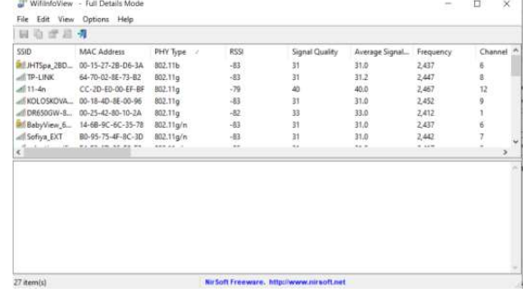

Рисунок 11. Результат сканирования ближайших беспроводных сетей

## Задание 8
Интернет-сервисы тестирования и определения параметров
компьютерной сети

 2IP Интернет-сайт — набор интернет-сервисов.
2ip.ru — сайт, предоставляет пользователю множество сервисов:
возможность узнать IP-адрес компьютера, проверку скорости соединения,
проверку открытия порта, получение информации об интернет-ресурсах (IP и
т. д.) и др. Также на сайте присутствует рейтинг провайдеров. При заходе на
2ip.ru – бонусом к функции определения IP предоставляется обзор
дополнительных данных об ОС, браузере, месте расположения и интернетпровайдере (см. рисунок 12).

Рисунок 12. Информация с сайта 2ip.ru

В меню «Тесты», которых в настоящий момент 32 штуки, можно увидеть
их список с коротким описанием. Все они могут пригодиться обычному
пользователю и касаются, в основном, характеристик соединения его
компьютера или мобильного гаджета с ресурсами Интернет.
В меню «Сервисы» предоставляются инструменты, которые пригодятся
непосредственно при разработке веб-сайтов и построении стратегии их
продвижения.
При изучении интернет-сервисов сайта 2ip.ru предлагается получить
сведения о своем компьютере и информацию о сайте (выбирается
самостоятельно).

## Контрольные вопросы для самопроверки
Контрольные вопросы для самопроверки

• Какой формат имени сетевого ресурса может использоваться при обращении к нему?

При обращении к сетевому ресурсу используются форматы IP-адресов (IPv4/IPv6), буквенные доменные имена (FQDN), NetBIOS-имена, а также URL-адреса, включающие протокол. Распространены форматы hostname (имя компьютера), sub.domain.tld (полное доменное имя) и UNC-пути (\Server\Share) в Windows-сетях.

• Какой протокол необходим для работы с утилитой ping? Найти описание и характеристики протокола.

Утилита ping использует протокол ICMP (Internet Control Message Protocol). ICMP — сетевой (интернет) протокол уровня IP (номер протокола 1), описан в RFC 792 и дополнительных RFC (напр., RFC 1122, RFC 4884, RFC 8335). Основные характеристики: служит для передачи сообщений об ошибках и диагностических сообщений (не для передачи пользовательских данных); типовая пара сообщений — Echo Request (Type 8) и Echo Reply (Type 0), используемая ping; структура сообщения: 8‑байтовый заголовок (Type, Code, Checksum, «rest of header»), затем данные (в запросах — полезная нагрузка, в сообщениях об ошибках — IP‑заголовок и первые 64 бита исходного пакета); используется для диагностики связности, traceroute, Path MTU Discovery (напр., Type 3 Code 4 — «fragmentation needed»); ICMP для IPv6 отличается (ICMPv6, другие типы/коды). Регистры типов/кодов поддерживаются IANA. Для подробной спецификации см. RFC 792 и IANA ICMP Parameters.

• Зачем используется параметр all в утилите ipconfig?

Параметр /all в утилите ipconfig используется для отображения полной и подробной информации о конфигурации TCP/IP для всех сетевых адаптеров (физических и виртуальных). В отличие от обычной команды ipconfig, он показывает MAC-адреса, параметры DHCP, DNS-серверы и время аренды IP-адресов.

• Каким образом утилиты ping и tracert осуществляют прослеживание маршрутов пакетов к заданному узлу?

Ping проверяет достижимость: посылает ICMP Echo Request и ждёт Echo Reply — показывает время отклика и потери. Tracert трассирует маршрут с помощью увеличения TTL (Time To Live): посылает пакеты с TTL=1,2,3…; каждый роутер, у которого TTL достигает 0, отбрасывает пакет и возвращает ICMP Time Exceeded — по этим ответам tracert получает адреса и времена каждого промежуточного хопа; когда достигается цель, приходит финальный ответ и трассировка заканчивается.

• Можно ли утилитой tracert задать максимальное число ретрансляций?

В Windows tracert есть опция -h для задания максимального числа прыжков (max hops), а опция -w задаёт таймаут в миллисекундах; прямой параметр количества попыток (ретрансляций) для каждого хопа отсутствует — по умолчанию отправляется 3 запроса на хоп. То есть нельзя изменить число попыток на хоп в стандартном tracert; для этого используют сторонние утилиты (например, mtr, WinMTR) или другие реализации traceroute, где есть соответствующие опции.

• Что такое localhost?

Localhost — зарезервированное имя (хостнейм), обозначающее саму локальную машину (локальный компьютер). Оно всегда указывает на адрес петли обратной связи: IPv4 — 127.0.0.1 (диапазон 127.0.0.0/8), IPv6 — ::1. Используется для тестирования сетевых служб и соединений без выхода в сеть: приложения, обращающиеся к localhost, связываются с сервисами на том же устройстве.